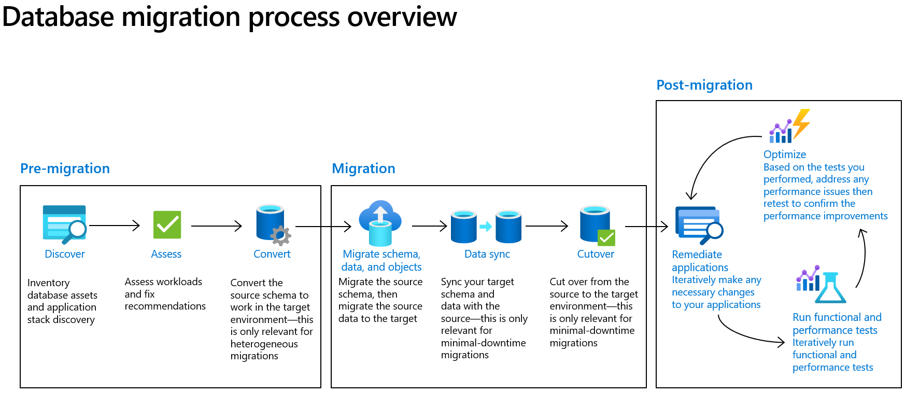

# **Database Migration Process Overview**

 

## **Post-Migration**

After migration it is important to use an iterative optimization process to ensure the best performance and functionality of your solution in the target environment

- **Verification**:
  - Verify the schema and data.
  - Application connectivity and post migration remediations.
- **Optimization Opportunities**:
  - Optimize with configuration changes identified during Assessment phase and look for key indicators.
  - Look for resource contention.
  - Check database performance.
- Use [Azure Advisor](https://azure.microsoft.com/en-us/products/advisor/#overview) for Azure deployments.
- Look for performance stats:
  - **PostgreSQL**
    - [Monitor Performance with Query Store](https://learn.microsoft.com/en-us/azure/postgresql/flexible-server/concepts-query-store).
    - [Perform intelligent tuning in Azure Database for PostgreSQL - Flexible Server](https://learn.microsoft.com/en-us/azure/postgresql/flexible-server/concepts-intelligent-tuning).
  - **SQL Server**
    - [Tune applications and databases for performance in Azure SQL Database and Azure SQL Managed Instance](https://learn.microsoft.com/en-us/azure/azure-sql/database/performance-guidance?view=azuresql).
    - [Perform intelligent tuning in Azure Database for PostgreSQL](https://learn.microsoft.com/en-us/azure/postgresql/flexible-server/concepts-intelligent-tuning).
 

 
