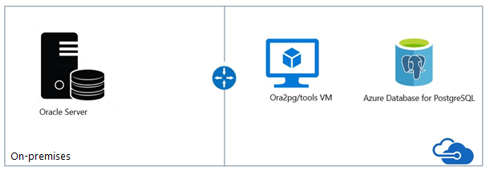

# **Oracle2PostgreSQL Scenario Guide**

Welcome to the Oracle to Azure PaaS database migration.

 

 

## **Typical Ora2PG Migration Architecture**

 

 

## **Prerequsites**

- Verify your source environment is supported.
- Download [Strawberry Perl](http://strawberryperl.com/)
- Download [Oracle Client](https://www.oracle.com/database/technologies/odac-downloads.html)
- Download the latest version of [ora2pg](https://ora2pg.darold.net/).
- Have the latest version of the [DBD](https://www.cpan.org/modules/by-module/DBD/) module.
 

 

## **Ora2PG**

Ora2Pg is a free tool used to migrate an Oracle database to a PostgreSQL compatible schema. It connects your Oracle database, scans it automatically and extracts its structure or data, then generates SQL scripts that you can load into your PostgreSQL database.
 
Ora2Pg can be used for anything from reverse engineering Oracle database to huge enterprise database migration or simply replicating some Oracle data into a PostgreSQL database. It is really easy to use and doesn't require any Oracle database knowledge other than providing the parameters needed to connect to the Oracle database.
 

 

- [Installation Document](https://ora2pg.darold.net/documentation.html#INSTALLATION)
    - [Strawberry Perl](http://strawberryperl.com/)
    - [Oracle Client](https://www.oracle.com/database/technologies/odac-downloads.html)
    - [Ora2PG](https://github.com/darold/ora2pg/releases)
     
- [Configuration Document](https://ora2pg.darold.net/documentation.html#CONFIGURATION)
 

 

## **Discover**

The goal of the discovery phase is to identify existing data sources and details about the features that are being used. This phase helps you better understand and plan for the migration. The process involves scanning the network to identify all your organization's Oracle instances together with the version and features in use.
 

Microsoft pre-assessment scripts for Oracle run against the Oracle database. The pre-assessment scripts query the Oracle metadata. The scripts provide:

- A database inventory, including counts of objects by schema, type, and status.
- A rough estimate of the raw data in each schema, based on statistics.
- The size of tables in each schema.
- The number of code lines per package, function, procedure, and so on.
- To improve the performance of the assessment or export operations in the Oracle server, collect statistics:
 

<pre>
<code>
BEGIN

   DBMS_STATS.GATHER_SCHEMA_STATS
   DBMS_STATS.GATHER_DATABASE_STATS
   DBMS_STATS.GATHER_DICTIONARY_STATS
   END;
</code>
</pre>
 

 

## **Assessment**

To assess the migration cost, ora2pg checks all database objects, functions, and stored procedures for objects and PL/SQL code that it can't automatically convert.

The ora2pg tool has a content analysis mode that inspects the Oracle database to generate a text report. The report describes what the Oracle database contains and what can't be exported.
 

To activate the analysis and report mode, use the exported type SHOW_REPORT as shown in the following command:
<pre>
<code>
ora2pg -t SHOW_REPORT
</code>
</pre>
 

To estimate the migration cost in human-days, ora2pg allows you to use a configuration directive called ESTIMATE_COST. You can also enable this directive at a command prompt:
<pre>
<code>
ora2pg -t SHOW_REPORT --estimate_cost
</code>
</pre>
 

In the following code example, you see some assessment variations:

- Tables assessment
- Columns assessment
- Schema assessment that uses a default cost unit of 5 minutes
- Schema assessment that uses a cost unit of 10 minutes

<pre>
<code>
ora2pg -t SHOW_TABLE -c c:\ora2pg\ora2pg_hr.conf > c:\ts303\hr_migration\reports\tables.txt 
ora2pg -t SHOW_COLUMN -c c:\ora2pg\ora2pg_hr.conf > c:\ts303\hr_migration\reports\columns.txt
ora2pg -t SHOW_REPORT -c c:\ora2pg\ora2pg_hr.conf --dump_as_html --estimate_cost > c:\ts303\hr_migration\reports\report.html
ora2pg -t SHOW_REPORT -c c:\ora2pg\ora2pg_hr.conf –-cost_unit_value 10 --dump_as_html --estimate_cost > c:\ts303\hr_migration\reports\report2.html
</code>
</pre>
 

 

## **Convert**

- Export data by using the COPY command instead of INSERT.
- Avoid exporting tables with their foreign keys (FKs), constraints, and indexes. These elements slow down the process of importing data into PostgreSQL.
- Create materialized views by using the no data clause. Then refresh the views later.
- If possible, use unique indexes in materialized views. These indexes can speed up the refresh when you use the syntax REFRESH MATERIALIZED VIEW CONCURRENTLY.

 

 

## **Migrate**

 

 

## **References**

 

 
