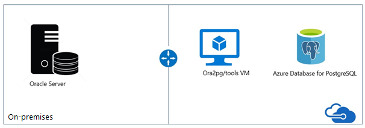

# **Oracle2PostgreSQL Scenario Guide**

This document is based on [Migrate Oracle to Azure Database for PostgreSQL](https://learn.microsoft.com/en-us/azure/postgresql/migrate/how-to-migrate-from-oracle) and aditional guides / contents / links are in individual titles.
 

 

## **Typical Ora2PG Migration Architecture**

 

 

## **Prerequsites**

- Verify your source environment is supported.
- Download [Strawberry Perl](http://strawberryperl.com/)
- Download [Oracle Client](https://www.oracle.com/database/technologies/odac-downloads.html)
- Download [PostgreSQL Client](https://www.postgresql.org/download/)
- Download the latest version of [ora2pg](https://ora2pg.darold.net/).
- Have the latest version of the [DBD](https://www.cpan.org/modules/by-module/DBD/) module.
- [MAP Tool kit](https://go.microsoft.com/fwlink/?LinkID=316883)
- [Azure Data Studio](https://learn.microsoft.com/en-us/sql/azure-data-studio/download-azure-data-studio?view=sql-server-ver16)
- [Database Migration Assessment for Oracle Extention](https://learn.microsoft.com/en-us/sql/azure-data-studio/extensions/database-migration-assessment-for-oracle-extension?view=sql-server-ver16)

 

 

## **Ora2PG**

Ora2Pg is a free tool used to migrate an Oracle database to a PostgreSQL compatible schema. It connects your Oracle database, scans it automatically and extracts its structure or data, then generates SQL scripts that you can load into your PostgreSQL database.
 
Ora2Pg can be used for anything from reverse engineering Oracle database to huge enterprise database migration or simply replicating some Oracle data into a PostgreSQL database. It is really easy to use and doesn't require any Oracle database knowledge other than providing the parameters needed to connect to the Oracle database.
 

 

- [Installation Document](https://ora2pg.darold.net/documentation.html#INSTALLATION)
    - [Strawberry Perl](http://strawberryperl.com/)
    - [Oracle Client](https://www.oracle.com/database/technologies/odac-downloads.html)
    - [PostgreSQL Client](https://www.postgresql.org/download/)
    - [Ora2PG](https://github.com/darold/ora2pg/releases)
    - [DBD](https://www.cpan.org/modules/by-module/DBD/)
     
- [Configuration Document](https://ora2pg.darold.net/documentation.html#CONFIGURATION)
 

 

## **Discover**

The goal of the discovery phase is to identify existing data sources and details about the features that are being used. This phase helps you better understand and plan for the migration. The process involves scanning the network to identify all your organization's Oracle instances together with the version and features in use.
 

- [Recommendations](https://learn.microsoft.com/en-us/azure/postgresql/migrate/how-to-migrate-from-oracle#recommendations)
- [Discover](https://learn.microsoft.com/en-us/azure/postgresql/migrate/how-to-migrate-from-oracle#discover)

- You can utilize **Microsoft Assessment and Planning Toolkit** to identify existing data sources and details about the features your organization is using. This process involves scanning the network to identify all your organization's Oracle instances, versions, and features.  
- To use the **MAP Toolkit** to perform an inventory scan, please refer to this [**guide document**](https://learn.microsoft.com/en-us/sql/sql-server/migrate/guides/oracle-to-sql-server?view=sql-server-ver16#discover).
 

 

## **Assessment**

After you inventory the Oracle databases, you'll have an idea of the database size and potential challenges. The next step is to run the assessment.
 

- Using [**Ora2PG**](https://learn.microsoft.com/en-us/azure/postgresql/migrate/how-to-migrate-from-oracle#assess)
- Using **Azure Data Studio** with [**Database Migration Assessment for Oracle extension (Preview)**](https://learn.microsoft.com/en-us/sql/azure-data-studio/extensions/database-migration-assessment-for-oracle-extension?view=sql-server-ver16)

 

 

## **Convert**

- Using [**Ora2PG**](https://learn.microsoft.com/en-us/azure/postgresql/migrate/how-to-migrate-from-oracle#assess)

 

### **Useful Tips & Guide**

- Oracle consider char(0) as a null value and PostgreSQL doesn't accept char(0) or '' value. You need to filter those value before the migration.
- Export data by using the COPY command instead of INSERT.
- Avoid exporting tables with their foreign keys (FKs), constraints, and indexes. These elements slow down the process of importing data into PostgreSQL.
- Create materialized views by using the no data clause. Then refresh the views later.
- If possible, use unique indexes in materialized views. These indexes can speed up the refresh when you use the syntax REFRESH MATERIALIZED VIEW CONCURRENTLY.
- Please refer to the [workaround guide](./Resources/Oracle%20to%20Azure%20Database%20for%20PostgreSQL%20Migration%20Workarounds.pdf) to compare Oracle and PostgreSQL.
- [SQLines References](https://www.sqlines.com/oracle-to-postgresql#sql-language-elements)

 

 

## **Migrate**

### **Migrate Schema and Data**

When you've made the necessary fixes, a stable build of the database is ready to deploy. Run the psql import commands, pointing to the files that contain the modified code. This task compiles the database objects against the PostgreSQL database and imports the data.
 
In this step, you can implement a level of parallelism on importing the data.
 

 

### **Compile Files**

You can choose to load the manually generated DDL files or use the second script import_all.sh to import those files interactively.

<pre>
<code>
psql -f %namespace%\schema\sequences\sequence.sql -h server1-server.postgres.database.azure.com -p 5432 -U username@server1-server -d database -l %namespace%\ schema\sequences\create_sequences.log

psql -f %namespace%\schema\tables\table.sql -h server1-server.postgres.database.azure.com p 5432 -U username@server1-server -d database -l %namespace%\schema\tables\create_table.log
</code>
</pre>
 

Here's the data import command:

<pre>
<code>
psql -f %namespace%\data\table1.sql -h server1-server.postgres.database.azure.com -p 5432 -U username@server1-server -d database -l %namespace%\data\table1.log

psql -f %namespace%\data\table2.sql -h server1-server.postgres.database.azure.com -p 5432 -U username@server1-server -d database -l %namespace%\data\table2.log
</code>
</pre>
While the files are being compiled, check the logs and correct any syntax that ora2pg couldn't convert on its own.
 

For more information, see [Oracle to Azure Database for PostgreSQL migration workarounds](./Resources/Oracle%20to%20Azure%20Database%20for%20PostgreSQL%20Migration%20Workarounds.pdf).
 

 

### **Sync data and cut over**

In online (minimal-downtime) migrations, the migration source continues to change. It drifts from the target in terms of data and schema after the one-time migration.
 
During the Data sync phase, ensure that all changes in the source are captured and applied to the target in near real time. After you verify that all changes are applied, you can cut over from the source to the target environment.
 
In a delta/incremental migration that uses ora2pg, for each table, use a query that filters (cuts) by date, time, or another parameter. Then finish the migration by using a second query that migrates the remaining data.
 

 

## **3rd Party Solutions**

- [Qlik(Attunity)](https://www.qlik.com/us/streaming-data/data-streaming-cdc)
- [SQLines](https://www.sqlines.com/oracle-to-postgresql)
- [Striim](https://www.striim.com/)
 

 

## **References**

- [Data Migration Whitepapers](https://github.com/microsoft/DataMigrationTeam/tree/master/Whitepapers)
- [Oracle to Azure Database for PostgreSQL Migration Cookbook](./Resources/Oracle%20to%20Azure%20Database%20for%20PostgreSQL%20Migration%20Cookbook.pdf)
- [Oracle to Azure Database for PostgreSQL Migration Guide](./Resources/Oracle%20to%20Azure%20Database%20for%20PostgreSQL%20Migration%20Guide.pdf)
- [Steps to Install ora2pg on Windows and Linux](./Resources/Steps%20to%20Install%20ora2pg%20on%20Windows%20and%20Linux.pdf)
- [ora2pg.conf](./Resources/ora2pg.conf.pdf)
- [Ora2PG Install](https://github.com/microsoft/OrcasNinjaTeam/tree/master/ora2pg-install)
 

 
