# **Oracle to Azure Database for PostgreSQL Hands on Lab Guide**

Welcome to the Oracle to Azure PaaS database migration.
 

 

## **Requirements**

- Microsoft Azure subscription.
 

 

### **Task 1: Windows 10 Virtual Machine Creation**

1. Connect Azure Portal, click create resource and click ‘Create’ Virtual Machine as below.  

 

2. Create new resource group as ‘OSSModernization’.  

 

3. Type VM name as ‘MigClientVM’ and choose ‘Windows 10 Pro, Version 20H2’ image.
4. Select preferred region.
5. Select Availability Option for ‘No infrastructure redundancy required’.  

 

6. Select Size for Standard_D2s_v3 (2CPU, 8GB MEM).
7. Type username as ‘demouser’ and password as ‘Password123$’.  

 

8. Review + Create.  

 

 

### **Task 2: Connect to Client VM**

1. Go Azure Portal and click the client VM you just created.
2. Copy Public IP Address  

 

3. Run Remote Desktop Connection and paste copied IP address.  

 

4. Connect and type username and password.  

 

5. Tick checkbox and Click Yes.  

 

6. Accept Privacy Setting.  

 

 

### **Task 3: Install Oracle Data Access Components**

1. On your VM, navigate to [Oracle download page](http://www.oracle.com/technetwork/database/windows/downloads/index-090165.html).
2. On the 64-bit Oracle Data Access Components (ODAC) Downloads page, scroll down and locate the 64-bit ODAC 12.2c Release 1 (12.2.0.1.1) for Windows x64 section, and then select the ODAC122011_x64.zip link.  

 

3. Accept the license agreement, and then select Download ODAC122011_x64.zip.  

 

4. When the download completes, extract the contents of the ZIP file to a local drive.
5. Navigate to the folder containing the extracted ZIP file, and right-click setup.exe, then select Run as administrator to begin the installation.
6. Select Next to accept the default language, English, on the first screen.
7. On the Specify Oracle Home User screen, accept the defaults. Use the Windows Built-in Account and select Next.
8. Accept the default installation location and select Next.
9. On the Available Product Components, uncheck Oracle Data Access Components Documentation for Visual Studio, and select Next.  

 

10. On the ODP.NET screen, check the box for Configure ODP.NET and/or Oracle Providers for ASP.NET at machine-wide level, and select Next.  

 

11. On the DB Connection Configuration screen, enter the following.

<pre>
<code>
Connection Alias: Northwind
Port Number: 1521
Database Host Name: 13.76.196.112
Database Service Name: XE
</code>
</pre>

 

12. Select Next.
13. If the Next button is disabled on the Perform Prerequisite Checks screen, check the Ignore All box, and then select Next. This screen will be skipped by the installer if no missing requisites are found.
14. On the Summary screen, select Install.
15. On the Finish screen, select Close.
 

 

### **Task 4: Install Visual Studio Code**

1. On your VM, navigate to [download page](http://code.visualstudio.com/Download).
2. Click System Installer 64bit to download installer.  

 

3. When the download completes, install VS Code.
4. When installation finished, open VS Code and go to Extensions.  

 

5. Type oracle in search box and install Oracle Developer Tools for VS Code.  

 

6. When installation finished, click ‘Go to Download Page’ button on pop-up message box.  

 

7. Download and install .Net Core Runtime for Windows X64.  

 

8. Close and Re-Open VS Code.
9. Go to the Oracle Explorer that you just installed extension.
10. Click + Icon to create new connection.  

 

16. On the DB Connection Configuration screen, enter the following.  
<pre>
<code>
Database Host Name: 13.76.196.112
Port Number: 1521
Service Name: XE
Username: NW
Password: oracledemo123
Connection Name: Northwind
</code>
</pre>

 

17. Click Create Connection Button.
18. Now you can see database tables in Oracle Explorer.  

 

 

### **Task 5: Create Azure Database for PostgreSQL**

1. Connect Azure Portal, click create resource and type ‘Azure database for PostgreSQL’ and select Azure Database for PostgreSQL.  
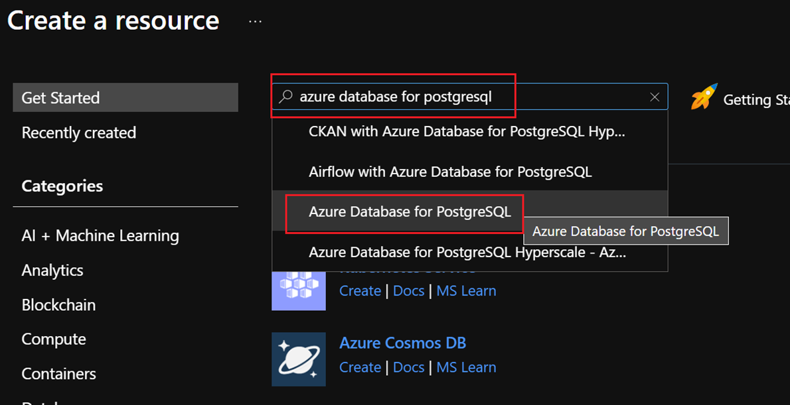
 
2. Click Create Button
3. Choose Flexible Server.  
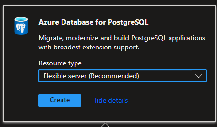
 

4. On Configuration screen, enter the following.
<pre>
<code>
Resource Group: OSS Modernization
Server Name: ossnorthwind
Location: (Asia Pacific) Southeast Asia
Compute + Storage: Basic 2Cores
Admin Username: demouser
Password: Password123$
</code>
</pre>
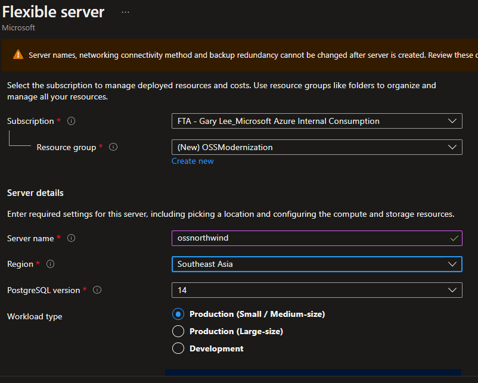
 

5. Review + Create.
6. When resource is created, go to the PostgreSQL resource.
7. Go to the ‘Networking’ under Settings.  
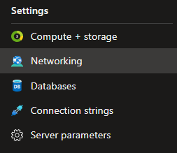
 

8. Choose connectivity method for public access.  
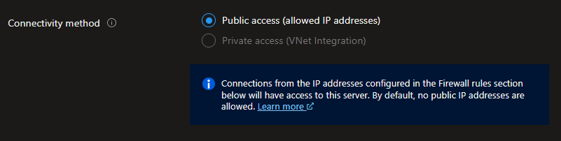
 

9. Type Firewall rule name as ‘MigClientVM’ and public IP address as below.  
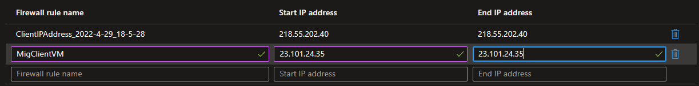
 

10. Click Save.
 

 

### **Task 6: Install pgAdmin on the VM**

1. You will need to navigate to [this link](https://www.pgadmin.org/download/pgadmin-4-windows/) to obtain pgAdmin 4. Select the link to the latest version installer, as shown below.  
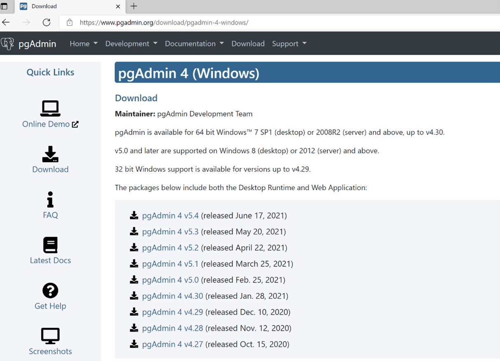
 

2. Once the installer launches, accept all defaults. Complete the installation steps.
3. Open pgAdmin. PgAdmin will prompt you to set a password to govern access to database credentials. Enter a password. Confirm your choice. For now, our configuration of pgAdmin is complete.  
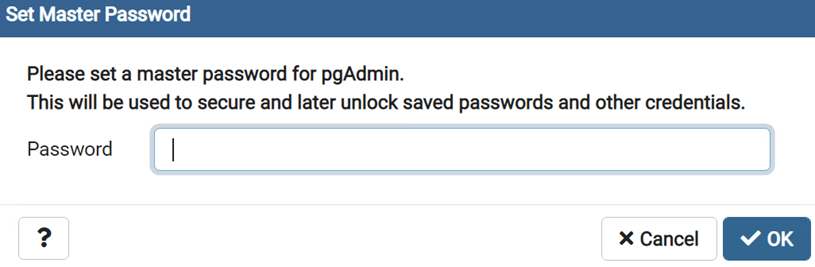
 

4. On the Browser left, mouse over on Servers Icon and click Create -> Server…  
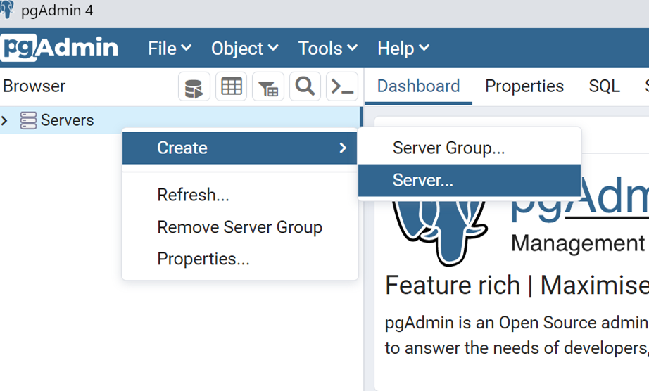
 

5. Type Northwind as Server Name.  
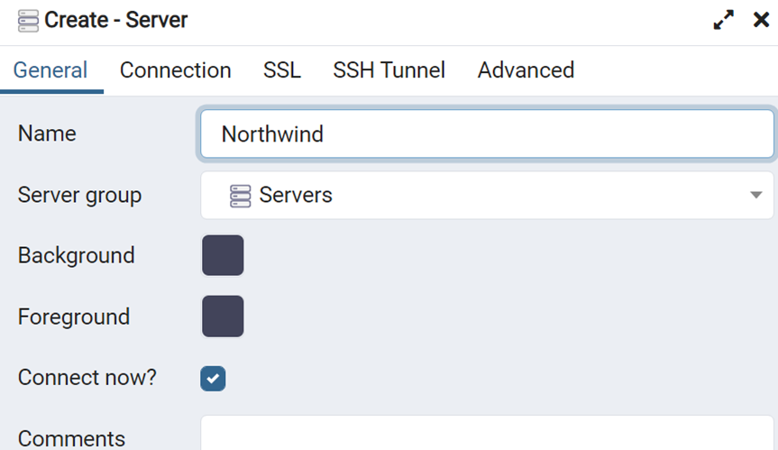
 

6. Go to the PostgreSQL and copy Server Name and Admin User Name as below.  
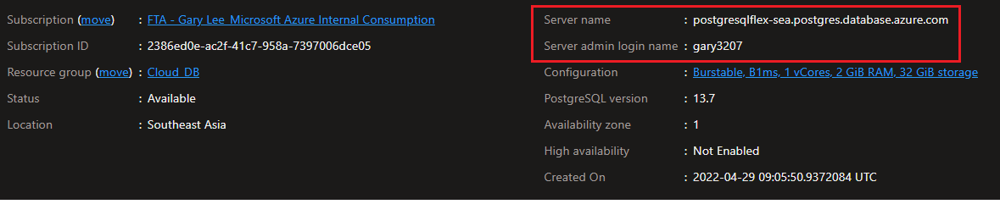
 

7. Put copied information into the pgAdmin connection setting.  
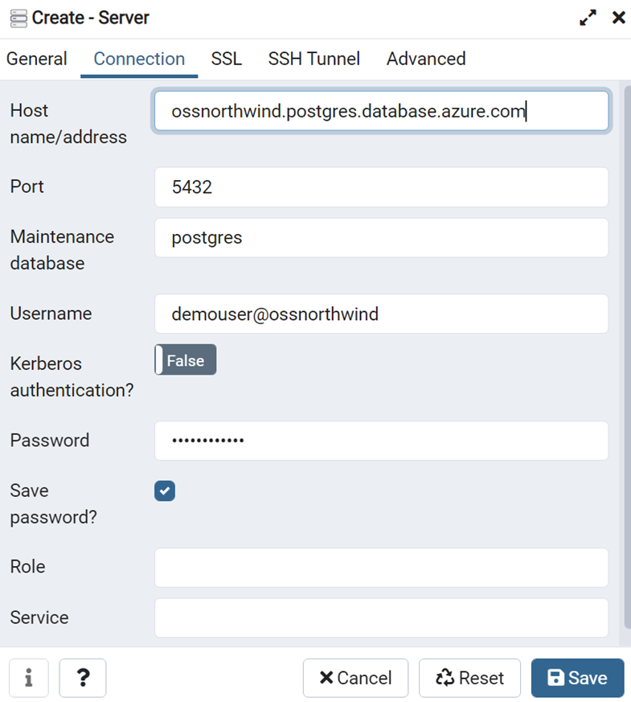
 

8. Now pgAdmin is connected to the PostgreSQL.  
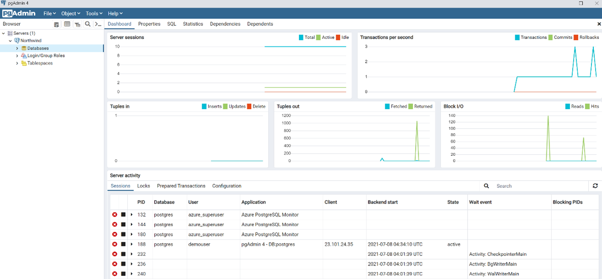
 

9. If the connection is successful, it should appear under the Servers browser dropdown.
10. Create a new role, which the application will reference. Under your connection, right-click Login/Group Roles. 
11. Select Create > Login/Group Role.... 
12. Name the role NW.
13. Under Definition, provide a secure password.
14. Under Privileges, change the Can log in? slider to the Yes position.  
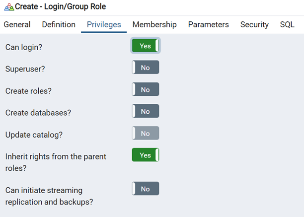
 

15. Save.
16. Right-click Databases under the connection you just created.  
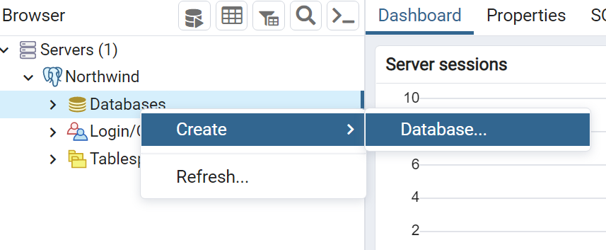
 

17. Name your database NW and Save.
 

 

### **Task 7: Install Ora2PG**

1. Install the Oracle client library and SDK. To do this, you will first need to navigate to [Oracle Downloads](https://www.oracle.com/kr/database/technologies/instant-client/winx64-64-downloads.html). Then, scroll to the Basic Package.
2. Download the zip file.  
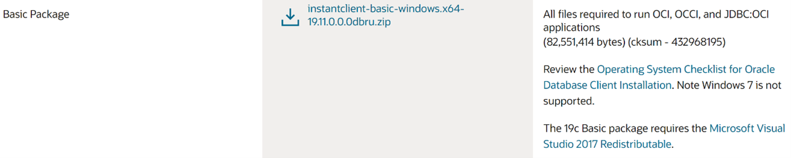
 

3. On the same Oracle link as above under the version section, locate the SDK Package installer under the Development and Runtime - optional packages section. Keep the zipped file in the Downloads directory.  
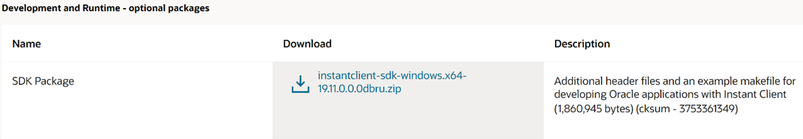
 

4. Extract downloaded files into ‘C:\instantclient’  
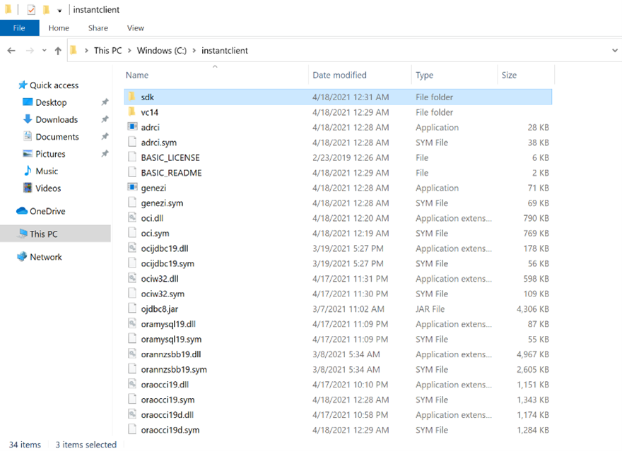
 

5. Download PowerShell script installora2pg.ps1 from [here](./Resources/installora2pg.ps1).
6. Run the PowerShell script downloaded in previous step with admin privilege. (Run Internet Explorer if you have Internet Connectivity Error)  
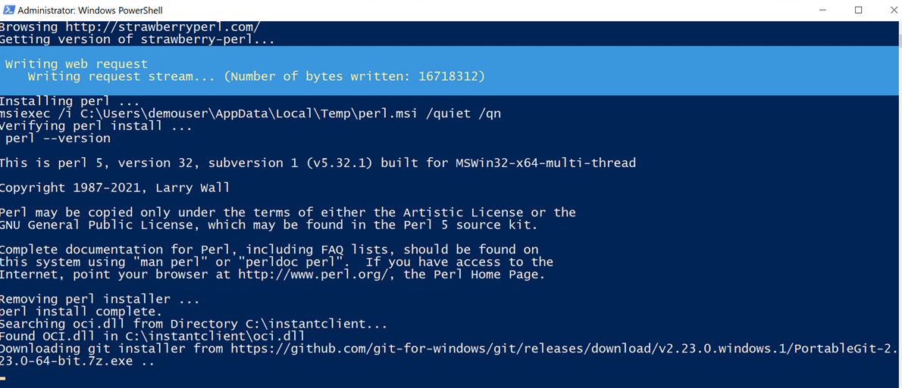
 

7. Check C:\ora2pg is created.  
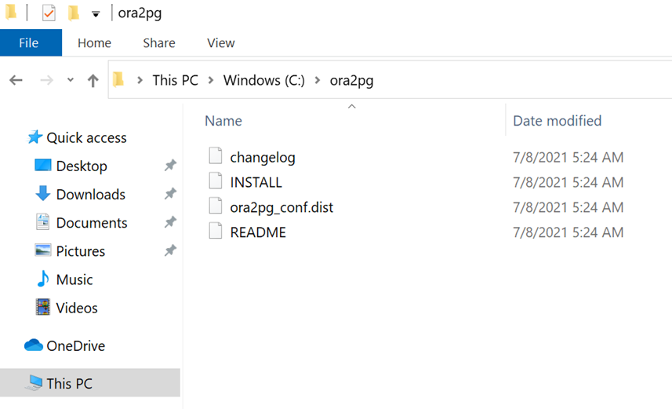
 

8. Go to the Setting -> Advanced System Setting -> Environment Variables.  
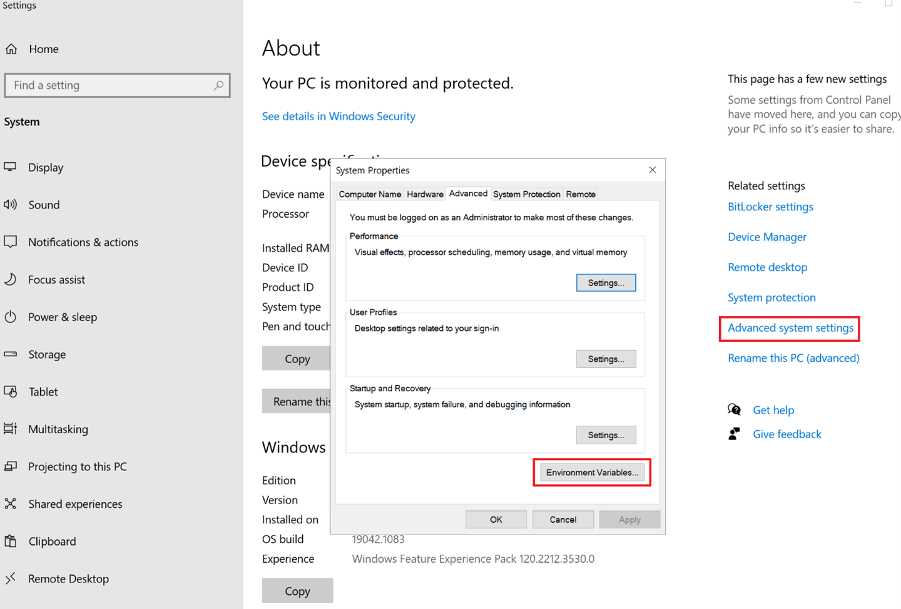
 

9. Under System Variables, select Path and click Edit.  

 

10.	Click New and type ‘C:\instantclient’ and ‘%%PATH%%’.  
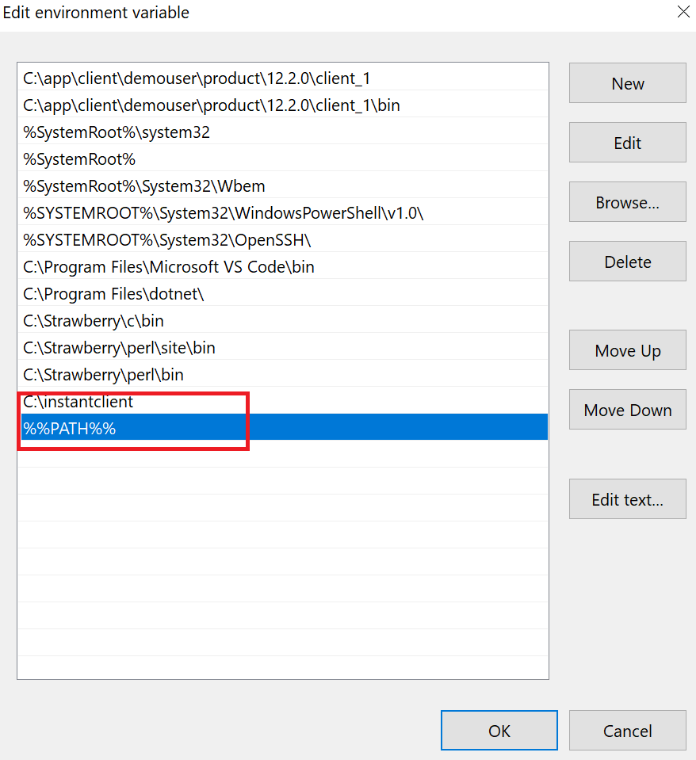
 

11. Click OK to exit.
 

 

### **Task 8: Create a Migration Assessment Report**

1. Open a command prompt window and navigate to the directory C:\ora2pg, where we will create the project structure.  
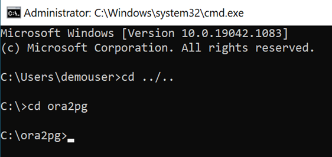
 

2. To create a project, we will use the ora2pg command with the --init_project flag. In the example below, our migration project is titled nw_migration.
3. Type “ora2pg -c ora2pg_conf.dist --init_project nw_migration”  
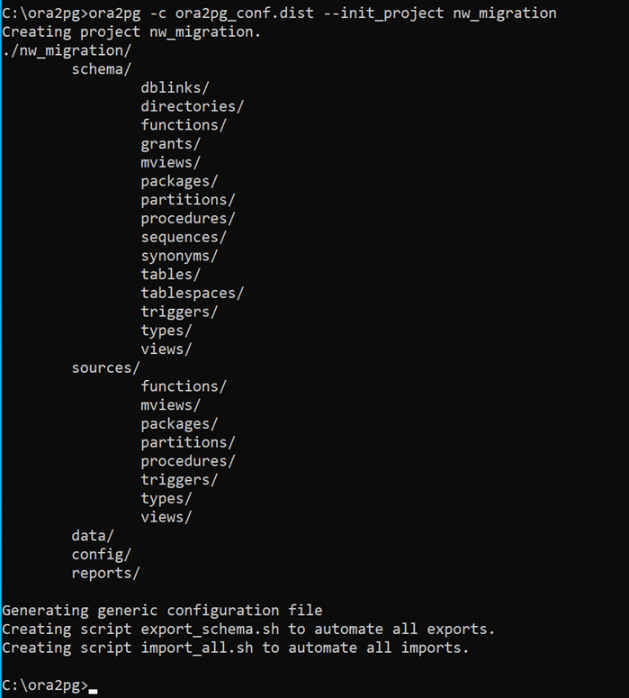
 

4. Verify that the command succeeded. There should be a folder with the same name as your migration project in the C:\ora2pg directory.  
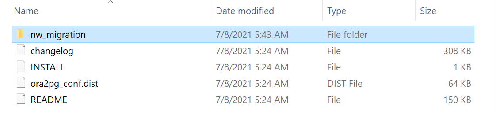
 

5. Navigate to the project directory and locate config\ora2pg.conf.
6. Select the file to open it. If you are asked to select an application to open the file, select Notepad. We will need to collect multiple parameters of the local Oracle database to put into the configuration file.
7. In the config\ora2pg.conf file, replace the old values in the file with the correct information.  
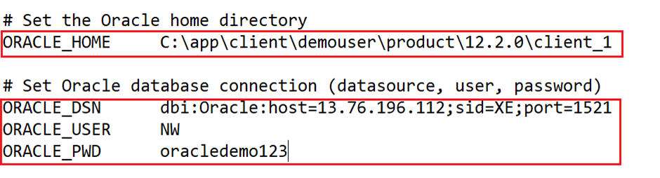
 

8. We will also need to populate connection information for our Postgre instance. We will use the role we created in the previous task.  
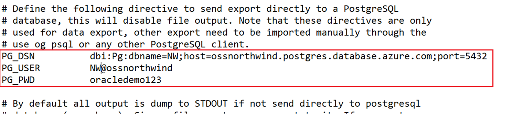
 

9. Now, specify the schema to migrate. In this scenario, we are migrating the NW schema.  
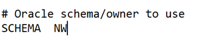
 

10. Navigate to the C:\ora2pg\nw_migration directory in command prompt.
11. Ora2pg provides a reporting functionality that displays information about the objects in the existing schema and the estimated effort required to ensure compatibility with PostgreSQL. The command below creates a report titled mig-report.html in the reports folder (when executed within the C:\ora2pg\nw_migration directory).
12. Type “ora2pg -c config\ora2pg.conf -t SHOW_REPORT --estimate_cost --dump_as_html > reports\mig-report.html” to create report.  
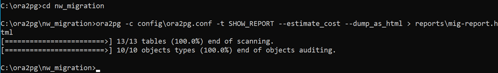
 

13. Open Assessment Report in C:/ora2pg/nw_migration/reports/mig-report.html.  
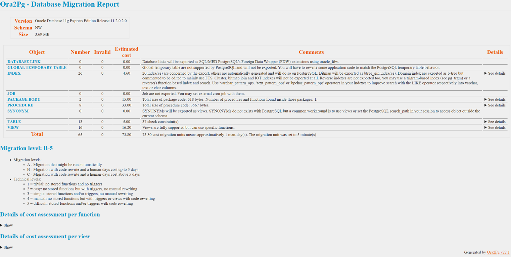
 

### **Task 9: Migrate the basic database table schema using ora2pg**

1. To start the database migration, DDL statements must be created for all valid Oracle objects.
2. In almost all migration scenarios, it is advised that table, index, and constraint schemas are kept in separate files. For data migration performance reasons, constraints should be applied to the target database only after tables are created and data copied. To enable this feature, open config\ora2pg.conf file. Set FILE_PER_CONSTRAINT, FILE_PER_INDEX, FILE_PER_FKEYS, and FILE_PER_TABLE to 1.  
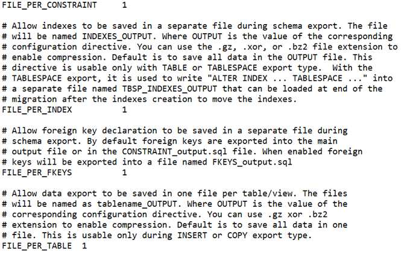
 

3. Call the following command in the C:\ora2pg\nw_migration directory to obtain object schemas (table schemas will be created in a file called NW-psql.sql).
“ora2pg -c config\ora2pg.conf -o NW-psql.sql -t TABLE -b schema\tables\”
4. In our scenario, 13 tables are exported. If you see an unreasonably large number, verify that you provided a schema in the configuration file (see step 8 of the previous task). If all was successful, you will see four files in the schema\tables directory.  
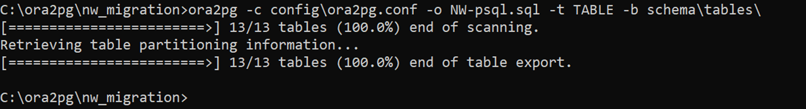  
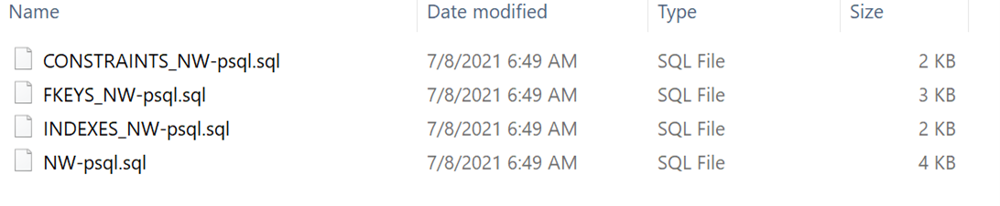
 

5. Enter the following command to run the NW-psql.sql file to create tables in the NW database.
“C:\Program Files\pgAdmin 4\v5\runtime\psql -U NW@ossnorthwind -h ossnorthwind.postgres.database.azure.com -d NW < schema\tables\NW-psql.sql”
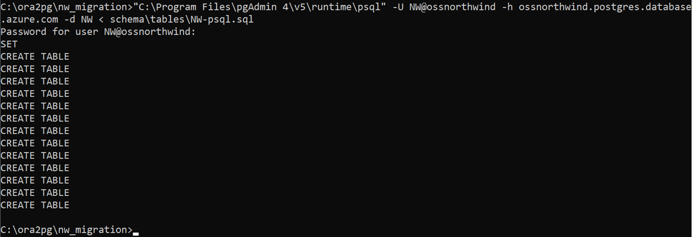
 
