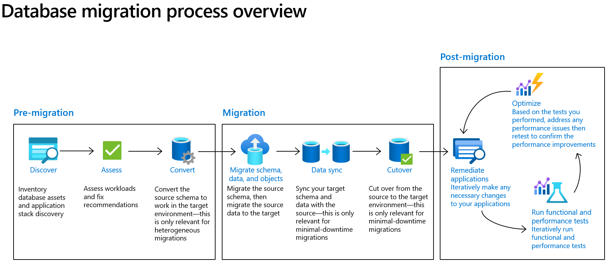

# **Oracle2AzurePaaS**

Welcome to the Oracle to Azure PaaS database migration.

 
 

## **1. Migration Drivers**

- Cost Optimization
- Application & Database Modernization
- Administrative Overhead
- Performance Improvement
- Cloud-First Mindset

[Migration Driver References for PostgreSQL](./02.Oracle2PostgreSQL/02-01.Migration_Drivers.md)
 

[Migration Driver References for SQL Database](./03.Oracle2SQL/03-01.Migration_Drivers.md)
 

## **2. Cloud Migration Strategy**

- **Rehost**: Often referred to as “lift and shift” migration, this no-code option lets you migrate your existing applications to Azure quickly. Each application is migrated as-is, which provides the benefits of the cloud without the risks or costs of making code changes, and you can leverage SQL Server on Azure Virtual Machines, Microsoft’s infrastructure as a service (IaaS) product, to achieve that.

- **Refactor**: Often referred to as repackage, this cloud migration strategy involves some change to the application design but no wholesale changes to the application code. Your application can take advantage of infrastructure as a service (IaaS) and platform as a service (PaaS) products, such as Azure App Service, Azure SQL Managed Instance, and containers.

- **Rearchitect**: Modify or extend your application's code base to scale and optimize it for the cloud. Modernize your app into a resilient, highly scalable, independently deployable architecture and use Azure SQL Database, Microsoft’s platform as a service (PaaS) offering, to accelerate the process, scale applications with confidence, and manage your apps with ease.

- **Rebuild**: Rebuild an application from scratch using cloud-native technologies. Azure platform as a service (PaaS) provides a complete development and deployment environment in the cloud, without the expense and complexity of software licenses, the need for underlying application infrastructure, or middleware and other resources. With this cloud migration strategy, you manage the applications and services you develop, and Azure manages everything else.

For more information about cloud migration strategies, see [Start your cloud migration process](https://azure.microsoft.com/en-us/migration/migration-journey/).

 

## **3. Database Migration Process Overview**

 

### **(1) Pre-Migration**

- **Discovery**
- **Assessment & Convert**
  - **PostgreSQL**
  - **SQL Database**

### **(2) Migration**

- **PostgreSQL**
- **SQL Database**

### **(3) Post-Migration**

 

## **4. Hands On Lab**

 

## **5. Multi-Tenant Architecture (SaaS Database Architecture)**

 
 

# **Learning Path**

# **Other Resources**

# **Contribution**

Welcomes for contributions and suggestions.
