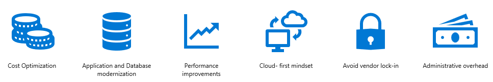

# **Oracle2AzurePaaS**

Welcome to the Oracle to Azure PaaS database migration. 
This document scope is within Oracle migration of [Azure Database Migration Guide](https://learn.microsoft.com/en-us/data-migration/).  

 

 

## **1. Migration Drivers**

- Cost Optimization
- Application & Database Modernization
- Administrative Overhead
- Performance Improvement
- Cloud-First Mindset

 

**Cost Optimization** is the largest number of cases for Oracle to Azure migration and typical scenario for Cost Optimization is Oracle to PostgreSQL migration scenario.  

In Oracle to PostgreSQL migration scenario, if customer is already optimized instance / objects / queries for performance with Oracle native features, **the performance can be a concern in PostgreSQL** after migration.  

For mission critical system or performance critical system, **Azure SQL Managed Instance** or **Azure Synapse Analytics** can be a better choice based on OLTP / OLAP workload.  

 

 

## **2. Cloud Migration & Modernization Process**

 

### **Migration Patterns which is based on Strategy**

- **Rehost**: Often referred to as “lift and shift” migration, this no-code option lets you migrate your existing applications to Azure quickly. Each application is migrated as-is, which provides the benefits of the cloud without the risks or costs of making code changes, and you can leverage SQL Server on Azure Virtual Machines, Microsoft’s infrastructure as a service (IaaS) product, to achieve that.  
[Oracle database migration: Lift and shift](https://learn.microsoft.com/en-us/azure/architecture/example-scenario/oracle-migrate/oracle-migration-lift-shift)

- **Refactor**: Often referred to as repackage, this cloud migration strategy involves some change to the application design but no wholesale changes to the application code. Your application can take advantage of infrastructure as a service (IaaS) and platform as a service (PaaS) products, such as Azure App Service, Azure SQL Managed Instance, and containers.  
[Oracle database migration: Refactor](https://learn.microsoft.com/en-us/azure/architecture/example-scenario/oracle-migrate/oracle-migration-refactor)

- **Rearchitect**: Modify or extend your application's code base to scale and optimize it for the cloud. Modernize your app into a resilient, highly scalable, independently deployable architecture and use Azure SQL Database, Microsoft’s platform as a service (PaaS) offering, to accelerate the process, scale applications with confidence, and manage your apps with ease.  
[Oracle database migration: Rearchitect](https://learn.microsoft.com/en-us/azure/architecture/example-scenario/oracle-migrate/oracle-migration-rearchitect)

- **Rebuild**: Rebuild an application from scratch using cloud-native technologies. Azure platform as a service (PaaS) provides a complete development and deployment environment in the cloud, without the expense and complexity of software licenses, the need for underlying application infrastructure, or middleware and other resources. With this cloud migration strategy, you manage the applications and services you develop, and Azure manages everything else.

For more information about cloud migration patterns, see [Cloud Migration Pattern](https://learn.microsoft.com/en-us/azure/cloud-adoption-framework/migrate/azure-best-practices/contoso-migration-overview#migration-patterns).

 

 

## **3. Database Migration Process Overview**

 

### **(1) Pre-Migration**

- **Discovery**
  - Detail Guidance for [Discovery](./01.MigrationStrategy/01_01.Discovery.md)
 

 

- **Assessment & Convert**
  - Detail Guidance for [Oracle to PostgreSQL](./02.Oracle2PostgreSQL/02_01.Assessment_N_Convert.md) Migration Scenario.
  - Detail Guidance for [Oracle to SQL Database](./03.Oracle2SQL/03_01.Assessment_N_Convert.md) Migration Scenario.
 

 

### **(2) Migration**

- Detail Guidance for [Oracle to PostgreSQL](./02.Oracle2PostgreSQL/02_02.Migration.md) Migration Scenario.
- Detail Guidance for [Oracle to SQL Database](./03.Oracle2SQL/03_02.Migration.md) Migration Scenario.
 

 

### **(3) Post-Migration**

- Detail Guidance for [Post-Migration](./01.MigrationStrategy/01_02.PostMigration.md)
 

 

## **4. Hands On Lab**

- [Before the Hands On Lab](https://github.com/microsoft/MCW-Migrating-Oracle-to-Azure-SQL-and-PostgreSQL/blob/master/Hands-on%20lab/Before%20the%20HOL%20-%20Migrating%20Oracle%20to%20Azure%20SQL%20and%20PostgreSQL.md)
- Hands On Lab Exercise for [Oracle to PostgreSQL](https://github.com/microsoft/MCW-Migrating-Oracle-to-Azure-SQL-and-PostgreSQL/blob/master/Hands-on%20lab/HOL%20step-by-step%20-%20Migrating%20Oracle%20to%20PostgreSQL.md) Migration Scenario.
- Hands On Lab Exercise for [Oracle to SQL Database](https://github.com/microsoft/MCW-Migrating-Oracle-to-Azure-SQL-and-PostgreSQL/blob/master/Hands-on%20lab/HOL%20step-by-step%20-%20Migrating%20Oracle%20to%20Azure%20SQL.md) Migration Scenario.
 

 

# **Learning Path**

|Topic|Level|Learning Path|
|-----|-----|-------------|
|Azure SQL fundamentals|Beginner|https://learn.microsoft.com/en-us/training/paths/azure-sql-fundamentals/|
|Azure Database for PostgreSQL|Beginner|https://learn.microsoft.com/en-us/training/paths/introduction-to-azure-postgres/|
|Get Started Querying with Transact-SQL|Beginner|https://learn.microsoft.com/en-us/training/paths/get-started-querying-with-transact-sql/|
|Secure your cloud data|Beginner|https://learn.microsoft.com/en-us/training/paths/secure-your-cloud-data/|
|Optimize government operations with Azure|Beginner|https://learn.microsoft.com/en-us/training/paths/optimize-government-operations/|
|Understand data concepts|Beginner|https://learn.microsoft.com/en-us/training/paths/understand-data-concepts/|
|Introduction to Azure database administration|Intermediate|https://learn.microsoft.com/en-us/training/paths/introduction-to-azure-database-administration/|
|Work with Azure Database for PostgreSQL|Intermediate|https://learn.microsoft.com/en-us/training/paths/microsoft-learn-azure-database-for-postgresql/|
|Architect a data platform in Azure|Intermediate|https://learn.microsoft.com/en-us/training/paths/architect-data-platform/|
|Implement a secure environment for a database service|Intermediate|https://learn.microsoft.com/en-us/training/paths/mplement-secure-environment-database-service/|
|Work with relational data in Azure|Intermediate|https://docs.microsoft.com/en-us/learn/paths/work-with-relational-data-in-azure/|
|Architect migration, business continuity, and disaster recovery in Azure|Intermediate|https://learn.microsoft.com/en-us/training/paths/architect-migration-bcdr/|
|Automate database tasks for Azure SQL|Intermediate|https://learn.microsoft.com/en-us/training/paths/automate-tasks-sql-server/|
|Migrate SQL workloads to Azure|Intermediate|https://learn.microsoft.com/en-us/training/paths/migrate-sql-workloads-azure/|
|Optimize query performance in Azure SQL|Intermediate|https://learn.microsoft.com/en-us/training/paths/optimize-query-performance-sql-server/|
|Program with Transact-SQL|Advanced|https://learn.microsoft.com/en-us/training/paths/program-transact-sql/|
|Write advanced Transact-SQL queries|Advanced|https://learn.microsoft.com/en-us/training/paths/write-advanced-transact-sql-queries/|

 

 

# **Contribution**

Welcomes for contributions and suggestions.
